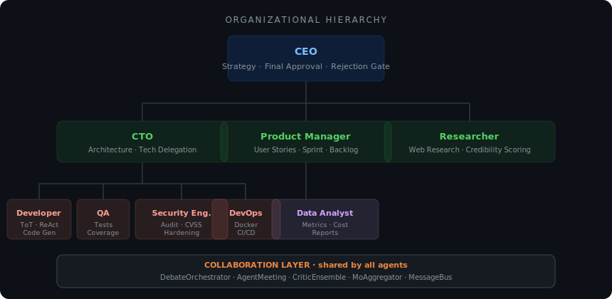
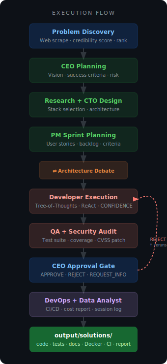
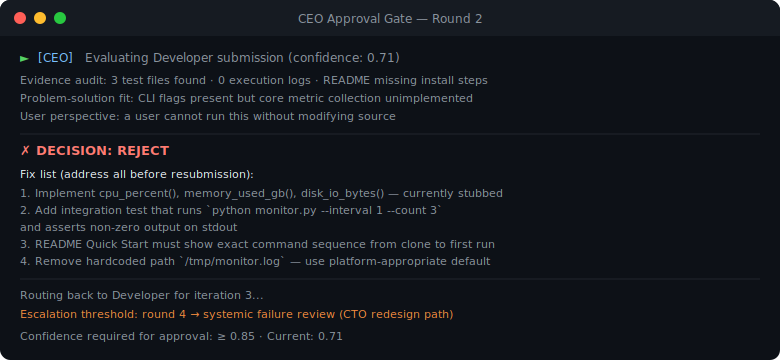
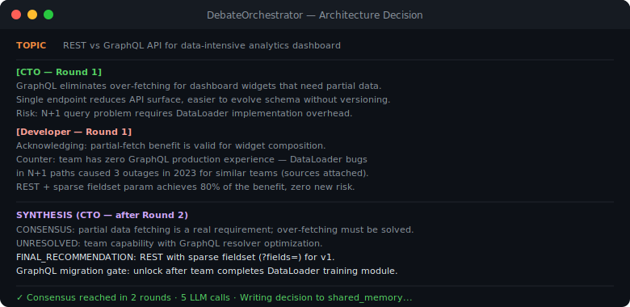
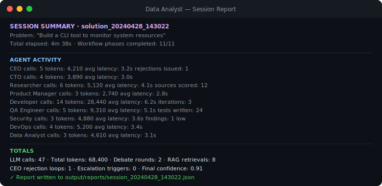

# Autonomous Company Orchestrator

**A hierarchical autonomous AI organization composed of role-specialized agents that independently discover problems, delegate execution, debate solutions, enforce quality rejection, and synthesize final outcomes — with persistent memory and RAG-backed context.**

[](https://python.org)
[](https://ollama.ai)
[](LICENSE)
[](agents/)

---

## Organizational Hierarchy



Nine specialists. One org chart. The CEO owns final approval — and rejects 30–40% of first submissions.

---

## Why Traditional LLM Agents Fall Short

Most single-agent and naive multi-agent systems suffer from the same structural failures:

| Failure Mode | Root Cause |
|---|---|
| Shallow reasoning | No specialist context — one model plays every role |
| No internal verification | Output is never challenged before delivery |
| Poor task decomposition | No org structure; work is serialized in a single prompt |
| Hallucination propagates | No cross-validation or credibility scoring |
| No governance | Anyone can approve anything — there is no rejection gate |
| No memory | Every run starts from zero |

**Autonomous Company Orchestrator** addresses each failure directly:

- **Role separation** — nine agents with dedicated system prompts, temperatures, and decision authority
- **Internal criticism** — Critic Ensemble and DebateOrchestrator challenge outputs before they reach the CEO
- **Iterative rejection** — CEO rejects work with a numbered fix list; Developer reruns until approval
- **Persistent memory** — RAG store, session memory, and cross-session learning survive between runs
- **Autonomous governance** — CEO approval criteria are code-defined and evidence-based, not vibes-based

---

## Core Architecture



### Organizational Layers

| Layer | Agent | Decision Authority |
|---|---|---|
| Executive | CEO | Final approve / reject / escalate |
| Engineering | CTO | Tech stack, architecture, engineering delegation |
| Engineering | Developer | Implementation; outputs `CONFIDENCE: X.X` on every submission |
| Engineering | QA Engineer | Test suite, coverage gate |
| Engineering | Security Engineer | CVSS audit, mandatory patch before CEO sees work |
| Engineering | DevOps Engineer | Docker, CI/CD, deployment manifests |
| Product | Product Manager | User stories, sprint plan, acceptance criteria |
| Research | Researcher | Web scraping, credibility scoring, cross-validation |
| Analytics | Data Analyst | Token usage, latency, cost, iteration metrics |

### Subsystem Map

| Subsystem | Module | Responsibility |
|---|---|---|
| Workflow engine | `orchestrator/workflow.py` | Phase-gated execution graph across 11 defined phases |
| Message bus | `orchestrator/message_bus.py` | Priority-queued async pub/sub between agents |
| Escalation | `orchestrator/escalation.py` | Auto-retry and fallback; systemic failure routing after round 4 |
| Structured debate | `collaboration/debate.py` | N-round argumentation with synthesis; used for architecture decisions |
| Agent meetings | `collaboration/meeting.py` | Brainstorm, decision, retrospective, devil's-advocate, 1-on-1 types |
| Critic ensemble | `collaboration/critic_ensemble.py` | Multiple agents critique same artifact independently |
| Thinking engine | `agents/thinking.py` | Configurable reasoning depth: MINIMAL → STANDARD → DEEP → EXHAUSTIVE |
| Tree of Thoughts | `agents/tree_of_thoughts.py` | Generates N solution branches, scores each, executes best |
| ReAct loop | `agents/react_loop.py` | Reason → Act → Observe for tool-using agents |
| RAG store | `memory/rag_store.py` | Local TF-IDF retrieval; no GPU; reuses patterns from past runs |
| Problem discovery | `research/problem_discoverer.py` | Autonomously generates tasks from web content; no manual prompt needed |

---

## Key Engineering Capabilities

| Capability | Description |
|---|---|
| **Hierarchical Task Delegation** | CEO routes work through CTO/PM layers; each layer owns its domain |
| **Autonomous Problem Discovery** | Web scraping + credibility scoring generates problem statements without user input |
| **Debate Orchestrator** | Structured N-round debate between agents; produces CONSENSUS / UNRESOLVED / FINAL_RECOMMENDATION |
| **CEO Quality Rejection Loop** | CEO rejects low-confidence or incomplete work with numbered fix list; routes back to Developer |
| **Tree of Thoughts + ReAct** | Developer generates N diverse implementation branches, scores them, executes the best |
| **Developer Confidence Scoring** | Every Developer submission ends with `CONFIDENCE: X.X`; CEO threshold is ≥ 0.85 |
| **Persistent Session Memory** | RAG store + session state survive between runs; past solutions inform future ones |
| **Escalation System** | After round 4 of rejection, triggers systemic failure review — CTO redesign path or PM rescoping |
| **Cost Governance** | Token usage, latency, and iteration counts tracked per agent per run |
| **First-Principles CoT** | Every agent uses structured chain-of-thought: understand → analyze → explore → evaluate → decide |
| **Credibility Scoring** | Researcher scores each source 0–1; cross-validates claims before passing to CTO |
| **Org-Level Memory** | Company culture, trust scores, hiring criteria, sprint history tracked across sessions |

---

## Sample Runs

### CEO Rejecting Substandard Work



### Agents Debating Architecture



### Session Cost and Activity Report



---

## Tech Stack

| Category | Technology |
|---|---|
| **LLM Backend** | [Ollama](https://ollama.ai) — fully local, no API keys, no cloud |
| **Default Model** | `qwen3:8b` per agent (configurable per role in `config/models.py`) |
| **Orchestration** | Custom Python phase-gated workflow engine |
| **Reasoning** | Tree of Thoughts · ReAct loop · First-principles chain-of-thought |
| **Collaboration** | Structured debate · Agent meetings · Critic ensemble · MoA aggregator |
| **Memory** | Local TF-IDF RAG · session memory · shared context · cross-session learning |
| **Retrieval** | scikit-learn TF-IDF cosine similarity (~20–30MB RAM, no GPU) |
| **Web Research** | BeautifulSoup4 · async scraper · credibility scorer · cross-validator |
| **Tools** | LSP integration · git tools · code formatter · test runner · MCP |
| **Logging** | Structured JSON logs · cost tracker · progress tracker · health checker |
| **UI** | Rich terminal · streaming output · interactive mode |

---

## Quick Start

**Requirements:** Python 3.10+, [Ollama](https://ollama.ai) installed and running

```bash
# 1. Clone
git clone https://github.com/Thrilok28021996/autonomous-company-orchestrator.git
cd autonomous-company-orchestrator

# 2. Install
pip install -r requirements.txt

# 3. Pull the default model
ollama pull qwen3:8b

# 4. Run with a problem statement
python main.py --run --problem "Build a CLI tool to monitor system resources"
```

Output lands in `output/solutions/solution_<timestamp>/`

### All Modes

| Mode | Command |
|---|---|
| Run with problem statement | `python main.py --run --problem "..."` |
| Enhance existing codebase | `python main.py --run --current-dir --problem "..."` |
| Autonomous problem discovery | `python main.py --discover` |
| Interactive session | `python main.py --interactive` |
| Scaffold only (no LLM) | `python main.py --run --scaffold --problem "..."` |
| Check available models | `python main.py --check-models` |

### Configuration

```python
# config/models.py — different model per agent
DEVELOPER_MODEL = "qwen2.5-coder:7b"
CEO_MODEL       = "qwen3:8b"
```

```bash
# Environment overrides
MULTI_AGENT_LLM_DATA_DIR=~/.autonomous-company   # data directory
OLLAMA_HOST=http://localhost:11434                # custom Ollama endpoint
```

---

## Project Structure

```
autonomous-company-orchestrator/
├── agents/                  # Nine specialist agents + shared base
│   ├── base_agent.py        # First-principles CoT, retry logic, cost tracking
│   ├── thinking.py          # Configurable reasoning depth engine
│   ├── tree_of_thoughts.py  # Branch-score-execute reasoning
│   ├── react_loop.py        # Reason-Act-Observe for tool agents
│   └── ceo · cto · researcher · product_manager · developer
│       qa_engineer · security_engineer · devops_engineer · data_analyst
│
├── orchestrator/            # Pipeline engine
│   ├── workflow.py          # 11-phase execution graph
│   ├── message_bus.py       # Priority-queued async agent communication
│   ├── task_manager.py      # Task lifecycle and priority
│   ├── escalation.py        # Failure routing and systemic review triggers
│   └── artifacts.py         # Artifact storage and retrieval
│
├── collaboration/           # Cross-agent protocols
│   ├── debate.py            # Structured N-round debate with synthesis
│   ├── meeting.py           # Meeting types: brainstorm, decision, retro, 1-on-1
│   ├── critic_ensemble.py   # Independent parallel critique
│   └── moa_aggregator.py    # Mixture-of-Agents output synthesis
│
├── company/                 # Org-level simulation
│   ├── organization.py      # Declarative org chart and department definitions
│   ├── sprint.py            # Sprint tracking
│   ├── backlog.py           # Product backlog management
│   ├── performance.py       # Agent performance metrics
│   └── culture · hiring · trust · meetings
│
├── memory/                  # Persistence layer
│   ├── rag_store.py         # Local TF-IDF RAG, no GPU required
│   ├── shared_memory.py     # All-agent shared context per run
│   ├── agent_memory.py      # Per-agent persistent memory
│   ├── session.py           # Session state management
│   ├── learning.py          # Cross-session pattern learning
│   └── context_manager.py
│
├── research/                # Autonomous problem discovery
│   ├── problem_discoverer.py
│   ├── web_scraper.py · web_search.py
│   ├── credibility.py       # Source credibility scoring (0–1)
│   └── cross_validator.py
│
├── config/                  # Model, role, and domain configuration
├── tools/                   # Agent tool integrations (git, LSP, test runner, MCP)
├── ui/                      # Rich terminal interface + streaming
├── docs/assets/             # Org chart · execution flow · terminal screenshots
├── tests/
├── main.py
└── requirements.txt
```

---

## Roadmap

- [ ] Web UI — real-time agent activity, cost dashboard, output browser
- [ ] OpenAI / Anthropic / Groq backend support alongside Ollama
- [ ] Parallel agent execution for independent pipeline phases
- [ ] GitHub Actions trigger — invoke pipeline from PR comment
- [ ] Tool plugin framework for custom agent capabilities
- [ ] Browser-based execution agents (Playwright integration)
- [ ] Multi-session long-term project memory
- [ ] Enterprise workflow integrations (Jira, Linear, Slack)

---

## Engineering Focus Areas Demonstrated

This project explores practical implementations of:

- Hierarchical multi-agent orchestration with real organizational authority
- Autonomous quality governance via rejection loops and escalation thresholds
- Reasoning-enhanced specialist agents (Tree of Thoughts, ReAct, first-principles CoT)
- Persistent organizational memory with local RAG retrieval
- Production-aware LLM cost monitoring and agent confidence scoring
- Structured inter-agent debate and consensus mechanisms

---

## License

MIT
