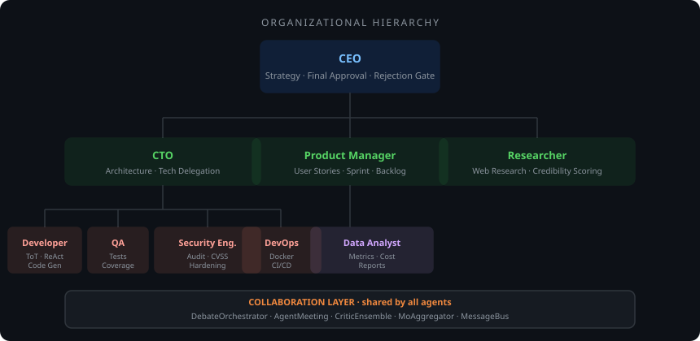
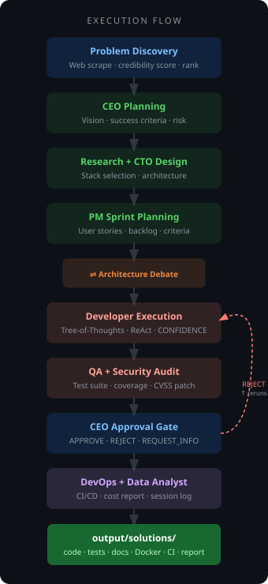
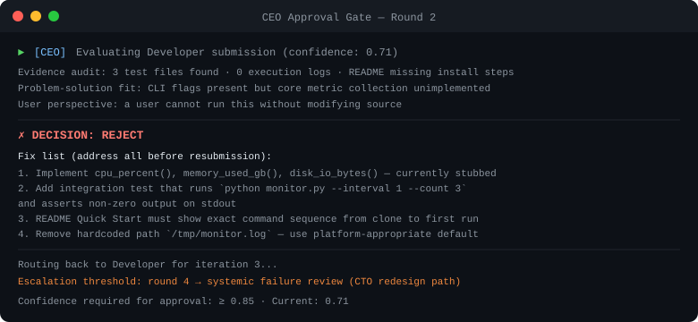
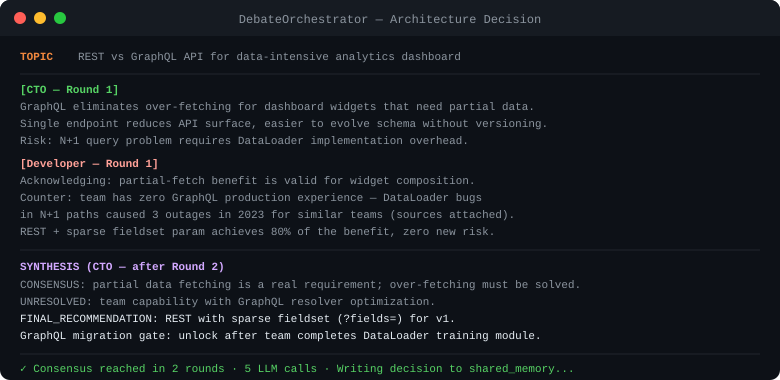
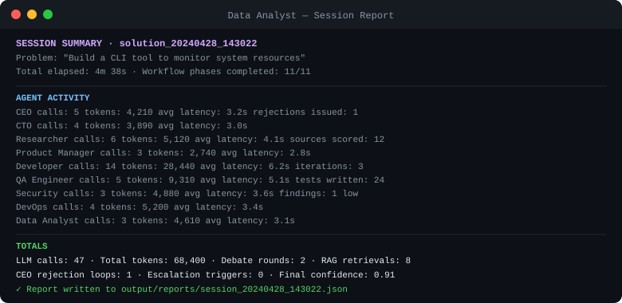

# Multi Agent LLM Company System

**A hierarchical autonomous AI organization composed of role-specialized agents that independently discover problems, delegate execution, debate solutions, enforce quality rejection, and synthesize final outcomes — with persistent memory and RAG-backed context.**

[](https://python.org)
[](https://lmstudio.ai)
[](https://ollama.ai)
[](LICENSE)
[](agents/)

---

## Organizational Hierarchy



Nine specialists. One org chart. The CEO owns final approval — rejecting submissions that fail validity or scope checks, based on the Developer's confidence score and the CTO/QA/Security review chain.

---

## Why Traditional LLM Agents Fall Short

Most single-agent and naive multi-agent systems suffer from the same structural failures:

| Failure Mode | Root Cause |
|---|---|
| Shallow reasoning | No specialist context — one model plays every role |
| No internal verification | Output is never challenged before delivery |
| Poor task decomposition | No org structure; work is serialized in a single prompt |
| Hallucination propagates | No cross-validation or credibility scoring |
| No governance | Anyone can approve anything — there is no rejection gate |
| No memory | Every run starts from zero |

**Multi Agent LLM Company System** addresses each failure directly:

- **Role separation** — nine agents with dedicated system prompts, temperatures, and model assignments
- **Internal criticism** — Critic Ensemble and DebateOrchestrator challenge outputs before they reach the CEO
- **Iterative rejection** — CEO rejects work with a numbered fix list; Developer reruns until approval
- **Persistent memory** — RAG store, session memory, and cross-session learning survive between runs
- **Autonomous governance** — CEO approval criteria are code-defined and evidence-based, not vibes-based

---

## Core Architecture



### Organizational Layers

| Layer | Agent | Decision Authority |
|---|---|---|
| Executive | CEO | Final approve / reject / escalate |
| Engineering | CTO | Tech stack, architecture, engineering delegation |
| Engineering | Developer | Implementation; outputs `CONFIDENCE: X.X` on every submission |
| Engineering | QA Engineer | Test suite, coverage gate |
| Engineering | Security Engineer | CVSS audit, mandatory patch before CEO sees work |
| Engineering | DevOps Engineer | Docker, CI/CD, deployment manifests |
| Product | Product Manager | User stories, sprint plan, acceptance criteria |
| Research | Researcher | Web scraping, credibility scoring, cross-validation |
| Analytics | Data Analyst | Token usage, latency, cost, iteration metrics |

### Subsystem Map

| Subsystem | Module | Responsibility |
|---|---|---|
| Workflow engine | `orchestrator/workflow.py` | Phase-gated execution graph across 13 defined phases |
| Plan mode | `orchestrator/plan_mode.py` | Claude Code-style planning with human approval steps |
| Message bus | `orchestrator/message_bus.py` | Priority-queued async pub/sub between agents |
| Escalation | `orchestrator/escalation.py` | Auto-retry and fallback; systemic failure routing after round 4 |
| Structured debate | `collaboration/debate.py` | N-round argumentation with synthesis; used for architecture decisions |
| Agent meetings | `collaboration/meeting.py` | Brainstorm, decision, retrospective, devil's-advocate, 1-on-1 types |
| Critic ensemble | `collaboration/critic_ensemble.py` | Multiple agents critique same artifact independently |
| Thinking engine | `agents/thinking.py` | Configurable reasoning depth: MINIMAL → STANDARD → DEEP → EXHAUSTIVE |
| Tree of Thoughts | `agents/tree_of_thoughts.py` | Generates N solution branches, scores each, executes best |
| HyperTree planner | `agents/hypertree_planner.py` | Hierarchical task decomposition across parallel sub-trees |
| ReAct loop | `agents/react_loop.py` | Reason → Act → Observe for tool-using agents |
| Agent tools | `agents/agent_tools_mixin.py` | 13 Claude Code-style tools: read/write/grep/bash/LSP/git/format/test |
| Personality | `agents/personality.py` | Per-agent personality traits + career progression across runs |
| RAG store | `memory/rag_store.py` | Local TF-IDF retrieval; no GPU; reuses patterns from past runs |
| Problem discovery | `research/problem_discoverer.py` | Autonomously generates tasks from web content; no manual prompt needed |

---

## Key Engineering Capabilities

| Capability | Description |
|---|---|
| **Hierarchical Task Delegation** | CEO routes work through CTO/PM layers; each layer owns its domain |
| **Autonomous Problem Discovery** | Web scraping + credibility scoring generates problem statements without user input |
| **Debate Orchestrator** | Structured N-round debate between agents; produces CONSENSUS / UNRESOLVED / FINAL_RECOMMENDATION |
| **CEO Quality Rejection Loop** | CEO rejects low-confidence or incomplete work with numbered fix list; routes back to Developer |
| **Tree of Thoughts + ReAct** | Developer generates N diverse implementation branches, scores them, executes the best |
| **Developer Confidence Scoring** | Every Developer submission ends with `CONFIDENCE: X.X`; CEO threshold is ≥ 0.85 |
| **Persistent Session Memory** | RAG store + session state survive between runs; past solutions inform future ones |
| **Escalation System** | After round 4 of rejection, triggers systemic failure review — CTO redesign path or PM rescoping |
| **Token Usage Governance** | Token usage, latency, and iteration counts tracked per agent per run |
| **Adaptive Chain-of-Thought** | Complex tasks trigger full `think()` + structured CoT; simple tasks skip the extra LLM call |
| **Credibility Scoring** | Researcher scores each source 0–1; cross-validates claims before passing to CTO |
| **Org-Level Memory** | Company culture, trust scores, hiring criteria, sprint history tracked across sessions |
| **Dual Backend Support** | Runs on LM Studio or Ollama; switch with one env var; model IDs resolved per backend |
| **Concurrency Control** | Async + sync semaphores prevent LM Studio queue spikes; configurable via `LLM_MAX_CONCURRENCY` |

---

## Sample Runs

### CEO Rejecting Substandard Work



### Agents Debating Architecture



### Session Cost and Activity Report



---

## Tech Stack

| Category | Technology |
|---|---|
| **LLM Backend** | [LM Studio](https://lmstudio.ai) or [Ollama](https://ollama.ai) — fully local, no API keys |
| **Orchestration** | Custom Python phase-gated workflow engine (13 phases) |
| **Reasoning** | Adaptive CoT · Tree of Thoughts · HyperTree planner · ReAct loop · First-principles thinking |
| **Collaboration** | Structured debate · Agent meetings · Critic ensemble · MoA aggregator |
| **Memory** | Local TF-IDF RAG · session memory · shared context · cross-session learning |
| **Web Research** | BeautifulSoup4 · async scraper · credibility scorer · cross-validator |
| **Tools** | LSP integration · git tools · code formatter · test runner (13-tool mixin) |
| **Logging** | Structured JSON logs · usage tracker · progress tracker · health checker |
| **UI** | Rich terminal · streaming output · interactive conversational mode |

---

## Quick Start

**Requirements:** Python 3.10+, [LM Studio](https://lmstudio.ai) or [Ollama](https://ollama.ai)

```bash
# 1. Clone
git clone https://github.com/Thrilok28021996/multi-agent-llm-company-system.git
cd multi-agent-llm-company-system

# 2. Install dependencies
pip install -r requirements.txt

# Optional: install as a CLI command
pip install -e .
# Then use: multi-agent-llm-company-system "Build a CLI tool..."

# 3. Configure
cp .env.example .env
# Edit .env — set LLM_BACKEND and model IDs for your setup

# 4. Run with a problem statement
python main.py "Build a CLI tool to monitor system resources"
```

Output lands in `output/solutions/solution_<timestamp>/`

### LM Studio Setup

```bash
# In .env
LLM_BACKEND=lmstudio
LMSTUDIO_HOST=http://localhost:1234/v1

# Per-role model IDs (LM Studio model identifier)
LMSTUDIO_MODEL_CEO=Jackrong/Qwen3.5-9B-Claude-4.6-Opus-Reasoning-Distilled-v2-GGUF
LMSTUDIO_MODEL_CTO=Jackrong/Qwen3.5-9B-Claude-4.6-Opus-Reasoning-Distilled-v2-GGUF
LMSTUDIO_MODEL_DEVELOPER=lmstudio-community/Qwen2.5-Coder-7B-Instruct-GGUF
LMSTUDIO_MODEL_QA_ENGINEER=lmstudio-community/DeepSeek-R1-Distill-Qwen-7B-GGUF
# ... (see .env.example for all 9 roles)
```

Open LM Studio → Local Server tab → Start Server. Models are auto-loaded on demand.

### Ollama Setup

```bash
# In .env
LLM_BACKEND=ollama
MODEL_CEO=qwen3.5:9b-q4_K_M
MODEL_DEVELOPER=qwen2.5-coder:14b
# ... (see .env.example for all 9 roles)

# Pull required models
ollama pull qwen3.5:9b-q4_K_M
ollama pull qwen2.5-coder:14b
```

### Recommended Models (16GB RAM)

#### LM Studio

| Tier | Model | RAM | Used By |
|---|---|---|---|
| Reasoning | `Jackrong/Qwen3.5-9B-Claude-4.6-Opus-Reasoning-Distilled-v2-GGUF` Q4_K_M | ~5.6GB | CEO, CTO, PM, Researcher, DataAnalyst |
| Code | `lmstudio-community/Qwen2.5-Coder-7B-Instruct-GGUF` Q4_K_M | ~4.4GB | Developer, DevOps, Security |
| QA | `lmstudio-community/DeepSeek-R1-Distill-Qwen-7B-GGUF` Q4_K_M | ~4.4GB | QA Engineer |

LM Studio swaps models on demand — peak RAM is max(reasoning, code) ≈ 5.6GB.

#### Ollama

| Tier | Model | RAM | Used By |
|---|---|---|---|
| Reasoning | `qwen3.5:9b-q4_K_M` | ~5.6GB | CEO, CTO, PM, Researcher, DataAnalyst |
| Code | `qwen2.5-coder:14b` | ~8.9GB | Developer, DevOps, Security, QA |

### All CLI Modes

| Mode | Command |
|---|---|
| Run with problem statement | `python main.py "Build a REST API for user auth"` |
| Auto-discover and solve problems | `python main.py --run` |
| Problem discovery only | `python main.py --discover` |
| Scaffold (skip research, fast path) | `python main.py --scaffold "FastAPI CRUD app for todos"` |
| Enhance existing codebase | `python main.py --enhance ./myproject "Add authentication"` |
| Batch multiple problems | `python main.py --problems "Build X" "Fix Y" "Create Z"` |
| Continuous loop mode | `python main.py --continuous` |
| Interactive conversational mode | `python main.py` (no arguments) |
| Human approval at decision points | `python main.py "..." --approve` |
| Resume from checkpoint | `python main.py --resume` |
| Resume specific session | `python main.py --session-id abc123` |
| Re-run past solution | `python main.py --rerun 3` |
| Check loaded models | `python main.py --check-models` |
| Switch backend at runtime | `python main.py "..." --backend lmstudio` |
| Design only, skip code execution | `python main.py "..." --dry-run` |
| Skip web research | `python main.py "..." --offline` |
| List past solutions | `python main.py --list-solutions` |
| List sessions | `python main.py --list-sessions` |
| Export solution as zip | `python main.py --export 3` |
| Rate a solution | `python main.py --feedback 3 good` |
| Generate default config.yaml | `python main.py --generate-config` |
| Target output directory | `python main.py "..." --target ./output` |
| Set programming language | `python main.py "..." --language typescript` |
| Set problem domain | `python main.py "..." --domain business` |
| Cap token budget | `python main.py "..." --max-tokens 50000` |
| Limit approval rounds | `python main.py "..." --max-rounds 3` |
| Time-based hard stop | `python main.py "..." --max-workflow-minutes 30` |
| Disable escalation system | `python main.py "..." --no-escalation` |
| Skip security review phase | `python main.py "..." --no-security` |
| Skip retrospective phase | `python main.py "..." --no-retrospective` |
| Allow partial delivery | `python main.py "..." --force-stop` |
| Debug output | `python main.py "..." --verbose` |
| Suppress output | `python main.py "..." --quiet` |

### Environment Variables

| Variable | Default | Description |
|---|---|---|
| `LLM_BACKEND` | `lmstudio` | `ollama` or `lmstudio` (code default: `ollama`; `.env.example` ships with `lmstudio`) |
| `OLLAMA_HOST` | `http://localhost:11434` | Ollama server URL |
| `LMSTUDIO_HOST` | `http://localhost:1234/v1` | LM Studio server URL |
| `MODEL_<ROLE>` | `goekdenizguelmez/JOSIEFIED-Qwen3:8b` etc. | Ollama model tag per role — override via `.env` (see `.env.example` for recommended values) |
| `LMSTUDIO_MODEL_<ROLE>` | same as above | LM Studio model ID per role — override via `.env` (see `.env.example` for recommended values) |
| `LLM_MAX_CONCURRENCY` | `2` | Max concurrent LLM calls (raise for high-RAM setups) |
| `MULTI_AGENT_LLM_DATA_DIR` | `~/.multi-agent-llm-company-system` | Internal data dir (logs, memory, reports) |
| `COMPANY_AGI_OUTPUT_DIR` | `output/solutions` | Generated code output directory |
| `COMPANY_AGI_RUN_TESTS` | `true` | Run tests after code generation |
| `COMPANY_AGI_STREAMING` | `true` | Enable streaming LLM output |
| `RATE_LIMIT_DELAY` | `2.0` | Seconds between LLM requests |
| `LOG_LEVEL` | `INFO` | Logging verbosity |

### Config File

Generate a `config.yaml` template (auto-discovered in CWD on startup):

```bash
python main.py --generate-config
```

The config file supports all workflow settings — model assignments, token budgets, output directories, and more. CLI flags override config file values. Supported filenames: `config.yaml`, `config.yml`, `config.json`, `.multi-agent-llm-company-system.yaml`.

### Internal Data Directory

All internal state (logs, memory, session data, reports) is stored in `~/.multi-agent-llm-company-system/`. Override with `MULTI_AGENT_LLM_DATA_DIR`. Generated code goes to `output/solutions/` (or `--target` / `--output-dir`).

---

## Project Structure

```
multi-agent-llm-company-system/
├── agents/                  # Nine specialist agents + shared base
│   ├── base_agent.py        # Adaptive CoT, retry logic, semaphore, context trimming
│   ├── thinking.py          # Configurable reasoning depth engine
│   ├── tree_of_thoughts.py  # Branch-score-execute reasoning
│   ├── hypertree_planner.py # Hierarchical task decomposition across sub-trees
│   ├── react_loop.py        # Reason-Act-Observe for tool agents
│   ├── agent_tools_mixin.py # 13-tool Claude Code-style mixin (read/write/grep/bash/git/LSP/fmt)
│   ├── personality.py       # Per-agent personality traits + career progression
│   └── ceo · cto · researcher · product_manager · developer
│       qa_engineer · security_engineer · devops_engineer · data_analyst
│
├── orchestrator/            # Pipeline engine
│   ├── workflow.py          # 13-phase execution graph
│   ├── plan_mode.py         # Planning with human approval steps
│   ├── message_bus.py       # Priority-queued async agent communication
│   ├── task_manager.py      # Task lifecycle and priority
│   ├── escalation.py        # Failure routing and systemic review triggers
│   └── artifacts.py         # Artifact storage and retrieval
│
├── collaboration/           # Cross-agent protocols
│   ├── debate.py            # Structured N-round debate with synthesis
│   ├── meeting.py           # Meeting types: brainstorm, decision, retro, 1-on-1
│   ├── critic_ensemble.py   # Independent parallel critique
│   └── moa_aggregator.py    # Mixture-of-Agents output synthesis
│
├── company/                 # Org-level simulation
│   ├── organization.py      # Declarative org chart and department definitions
│   ├── sprint.py            # Sprint tracking
│   ├── backlog.py           # Product backlog management
│   ├── performance.py       # Agent performance metrics
│   └── culture · hiring · trust · meetings
│
├── memory/                  # Persistence layer
│   ├── rag_store.py         # Local TF-IDF RAG, no GPU required
│   ├── shared_memory.py     # All-agent shared context per run
│   ├── agent_memory.py      # Per-agent persistent memory
│   ├── session.py           # Session state management
│   ├── learning.py          # Cross-session pattern learning
│   └── context_manager.py
│
├── research/                # Autonomous problem discovery
│   ├── problem_discoverer.py
│   ├── sources.py           # Configurable research sources (Reddit, HN, etc.)
│   ├── web_scraper.py · web_search.py
│   ├── credibility.py       # Source credibility scoring (0–1)
│   └── cross_validator.py
│
├── config/                  # Model, role, and backend configuration
│   ├── models.py            # Per-role ModelSpec; env-var override system
│   ├── llm_client.py        # Unified LM Studio + Ollama client
│   ├── config_loader.py     # YAML/JSON config file loader
│   ├── settings.py          # Global settings with env overrides
│   └── roles.py · validation.py
│
├── tools/                   # Agent tool integrations (git, LSP, test runner)
├── utils/                   # Health checker, usage tracker, output validator
├── ui/                      # Rich terminal interface + streaming
├── docs/assets/             # Org chart · execution flow · terminal screenshots
├── tests/
├── .env.example             # Full backend + model configuration template
├── main.py                  # CLI entry point (also: multi-agent-llm-company-system)
├── interactive_mode.py      # Standalone interactive coding session
└── requirements.txt
```

---

## Roadmap

- [ ] Web UI — real-time agent activity, usage dashboard, output browser
- [ ] OpenAI / Anthropic / Groq backend support
- [ ] Parallel agent execution for independent pipeline phases
- [ ] GitHub Actions trigger — invoke pipeline from PR comment
- [ ] Tool plugin framework for custom agent capabilities
- [ ] Browser-based execution agents (Playwright integration)
- [ ] Multi-session long-term project memory
- [ ] Enterprise workflow integrations (Jira, Linear, Slack)

---

## Engineering Focus Areas Demonstrated

This project explores practical implementations of:

- Hierarchical multi-agent orchestration with real organizational authority
- Autonomous quality governance via rejection loops and escalation thresholds
- Adaptive reasoning — full chain-of-thought only when complexity warrants it
- Dual-backend LLM routing (LM Studio + Ollama) with per-role model assignment via env vars
- Persistent organizational memory with local RAG retrieval (no GPU, no cloud)
- Production-aware LLM usage monitoring and agent confidence scoring
- Structured inter-agent debate and consensus mechanisms
- Concurrency control for local LLM servers under memory constraints

---

## License

MIT
